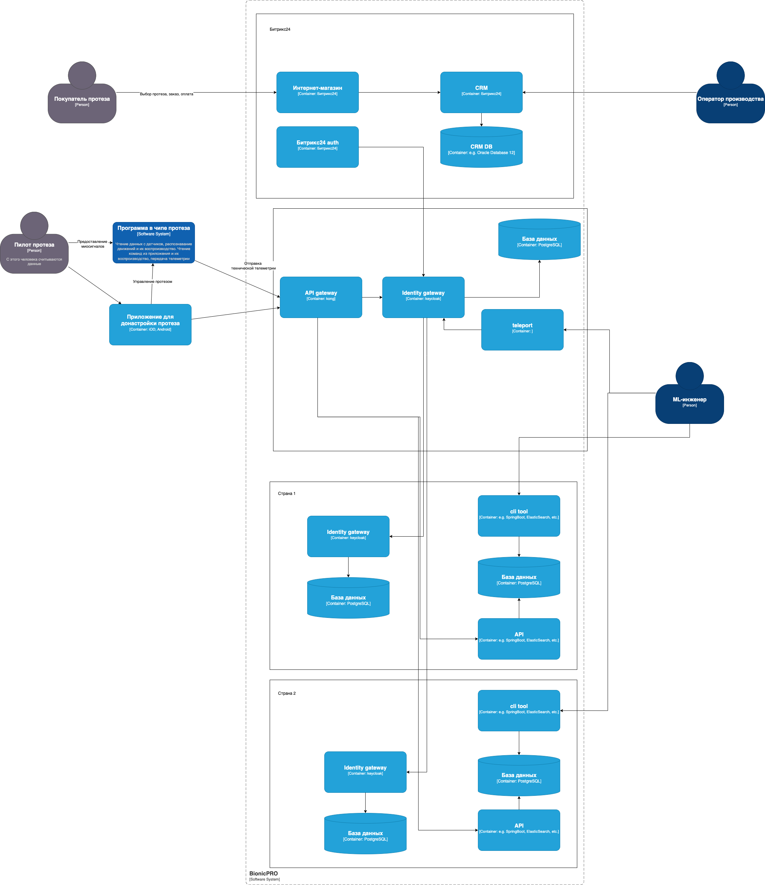
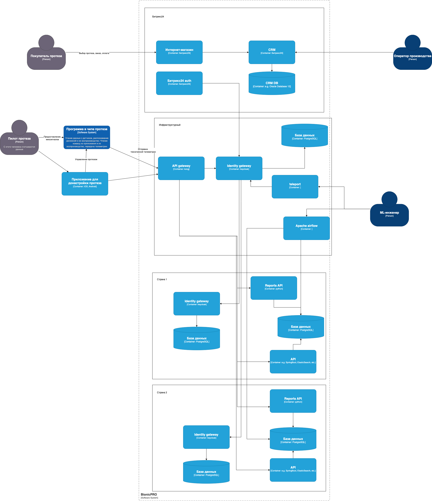

# Сдача проектной работы 9 спринта

## Повышение безопасности системы



[Скачать](BionicPRO_C4_model_task1.drawio.xml)

## Разработка сервиса отчётов



[Скачать](BionicPRO_C4_model_task2.drawio.xml)

## Как запускать

Необходимо проставить привилегии для записи:

```bash
chmod a+xrw dags
chmod a+xrw dags/sql
```

Далее можно все собрать с помощь docker compose:

```bash
docker compose up -d
```

После запуска всего необходимо зайти в [админку airflow](http://localhost:8081) и снять паузу с DAG и дождаться его завершения. После можно проверять [настроенное приложение](http://localhost:3000) и получить отчет по кнопке для своего пилота протезов. Сам отчет вернется в виде JSON ответа, можно проверить в инспекторе. 
